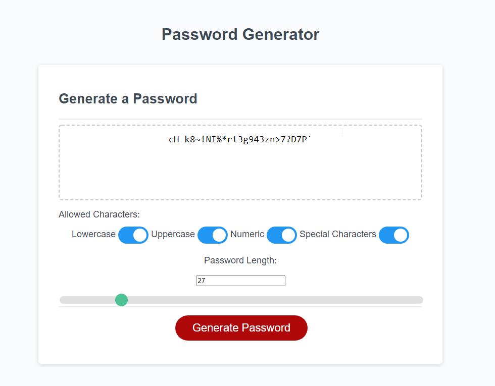
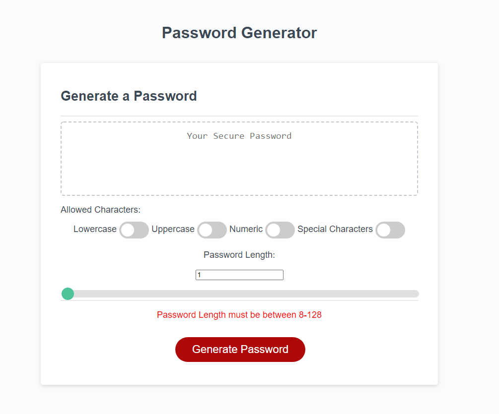
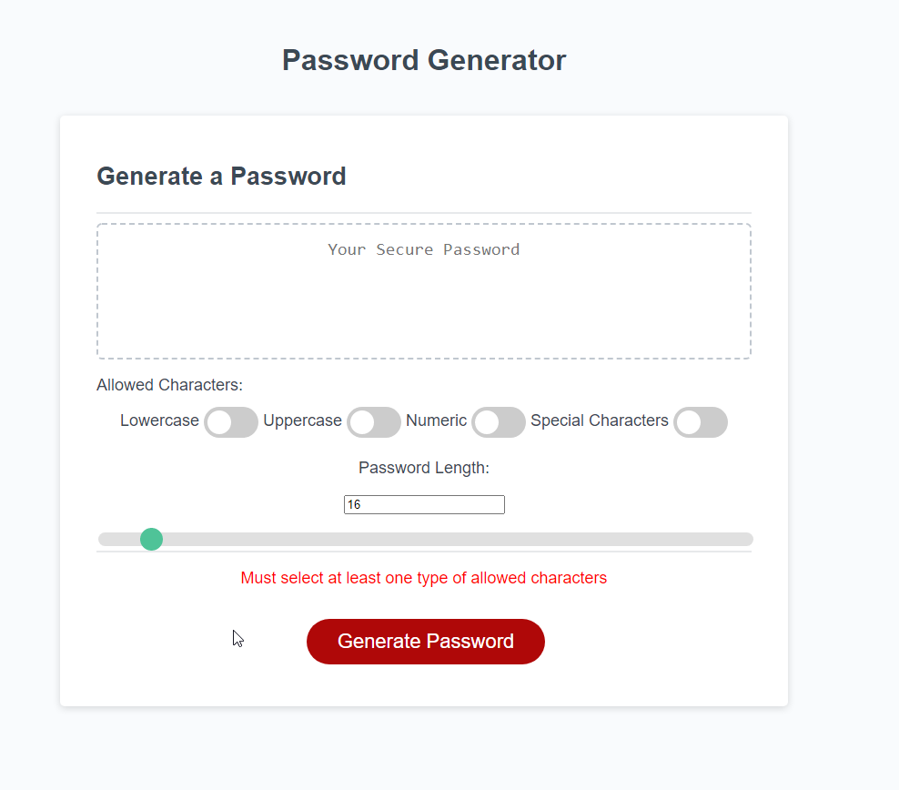

# Ali Baker Codes - PasswordGenerator
# Ali Baker Codes - My Portfolio

## Link

View this site live: [Password Generator](https://alibakercodes.github.io/PasswordGenerator2/)

Site git: [AliBakerCodes/PasswordGenerator2](https://github.com/AliBakerCodes/PasswordGenerator2)

## Description

This page will generate a random password given the criteria selected via the toggle switches (include lowercase, uppercase, numeric and/or special characters).

On click the password will be show in the text box that reads "Secure Password" on default. 

The user must select a password length between 8-128. This is accomplished using the slider at the bottom or by inputting a length in the input box. If a length outside of those bounds is inputted, the page will throw an error and a password will not be generated. If at least one character type is not selected the page will throw an error and the password will not be generated. 

The page code also covers an edge case where if truly random, the password could possibly not include at least one character of each type. The code checks for that and regenerates another password if the edge case presents.

## Screenshot

> **Note**: This layout is responsive down to 480px. 

##

© 2022 Ali Baker Codes. Confidential and Proprietary. All Rights Reserved.